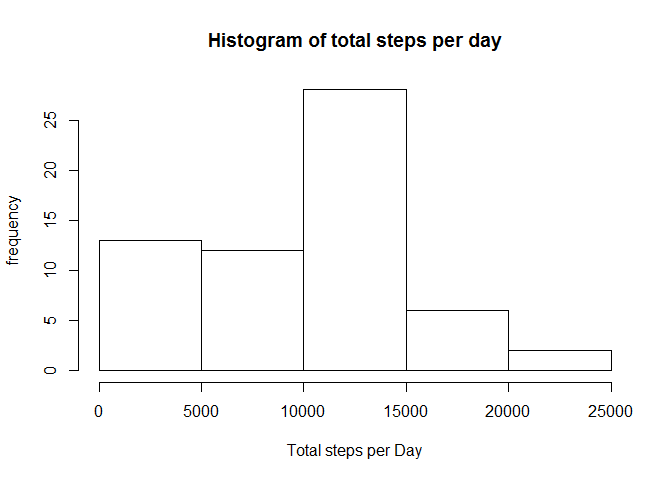

# Reproducible Research: Peer Assessment 1


## Loading and preprocessing the data
Load csv data 'activity.csv' and transform  the date data into a valid R date class . Assumes that the unziped data file 'activity.csv' is pesent in working dir.


```r
actData <- read.csv("activity.csv") # Read in data file

#actData$date <- strptime(actData$date, "%Y-%m-%d") ## Dates are in YYYY-MM-DD format, turn into Posix date
actData$date <-as.Date(actData$date,"%Y-%m-%d")
```


First few records of loaded data


```r
head(actData)
```

```
##   steps       date interval
## 1    NA 2012-10-01        0
## 2    NA 2012-10-01        5
## 3    NA 2012-10-01       10
## 4    NA 2012-10-01       15
## 5    NA 2012-10-01       20
## 6    NA 2012-10-01       25
```

Summary  of loaded data


```r
summary(actData)
```

```
##      steps            date               interval   
##  Min.   :  0.0   Min.   :2012-10-01   Min.   :   0  
##  1st Qu.:  0.0   1st Qu.:2012-10-16   1st Qu.: 589  
##  Median :  0.0   Median :2012-10-31   Median :1178  
##  Mean   : 37.4   Mean   :2012-10-31   Mean   :1178  
##  3rd Qu.: 12.0   3rd Qu.:2012-11-15   3rd Qu.:1766  
##  Max.   :806.0   Max.   :2012-11-30   Max.   :2355  
##  NA's   :2304
```

## What is mean total number of steps taken per day?

Total number of steps per day 


```r
totalStepsPerDay <- tapply(actData$steps, actData$date,sum, na.rm=TRUE)
```

Histogram of **total number of steps per day**


```r
hist(totalStepsPerDay,xlab="Total steps per Day", 
      ylab="frequency", main="Histogram of total steps per day")
```

 

The mean of total steps per day


```r
mean(totalStepsPerDay,na.rm=TRUE)
```

```
## [1] 9354
```


The median  of total steps per day

```r
median(totalStepsPerDay,na.rm=TRUE)
```

```
## [1] 10395
```


## What is the average daily activity pattern?
Time series on each interval averaged across all days( 61 days)


```r
#step per each interval averaged over all days
avgStepsPerInterval <- tapply(actData$steps,actData$interval,                            
                              mean,na.rm=TRUE)
uniqueIntervals <- row.names(avgStepsPerInterval)
plot(uniqueIntervals, avgStepsPerInterval, type="l",
     main="Average number of steps per interval across all days", 
     xlab="Intervals( of 5-mins)", ylab="Average # of steps across all days", 
     lwd=2 , col="64")
```

 


Time interval that contains maximum average number of steps over all days


```r
names(which.max(avgStepsPerInterval))
```

```
## [1] "835"
```

## Imputing missing values
Number of NA values in the  dataset


```r
sum(is.na(actData))
```

```
## [1] 2304
```

Impute   missing values with  the 'average  steps in  that interval across all days' and create a new data set.


```r
actDataNew <- actData;
for (  i in 1: nrow(actDataNew))
    {
       rw <- actDataNew[i,]
      
       if ( is.na(actDataNew[i,"steps"]))
            {
               actDataNew[i, "steps"] <- avgStepsPerInterval[paste("",actDataNew[i, "interval"], sep="")]
            }
    }
```

 First few rows of new Data set 

```r
head ( actDataNew)
```

```
##     steps       date interval
## 1 1.71698 2012-10-01        0
## 2 0.33962 2012-10-01        5
## 3 0.13208 2012-10-01       10
## 4 0.15094 2012-10-01       15
## 5 0.07547 2012-10-01       20
## 6 2.09434 2012-10-01       25
```

Histogram on new dataset after Imputing missing values with Avg value.

```r
totalStepsPerDay <- tapply(actDataNew$steps, actDataNew$date,sum, na.rm=TRUE)
hist(totalStepsPerDay,xlab="Total steps per Day", 
      ylab="frequency", main="Histogram of total steps per day on imputed Data set")
```

 

The mean of total steps per day of Imputed dataset


```r
mean(totalStepsPerDay,na.rm=TRUE)
```

```
## [1] 10766
```


The median  of total steps per day of Imputed dataset

```r
median(totalStepsPerDay,na.rm=TRUE)
```

```
## [1] 10766
```


## Are there differences in activity patterns between weekdays and weekends?


```r
days <- weekdays(actDataNew$date)
actDataNew$dayType <- ifelse(days == "Saturday" | days == "Sunday", 
                                "Weekend", "Weekday")

avgStepsPerIntrPerDayType <- with(actDataNew, aggregate(x=steps, by=list(interval, dayType), 
                                                  FUN=function(x) mean(x, na.rm=T)))
names(avgStepsPerIntrPerDayType) <- c("interval","dayType","steps")
library(lattice)
xyplot(steps~interval | dayType, avgStepsPerIntrPerDayType,type="l",
       layout=c(1,2),xlab="Interval",ylab = "Avg  of steps")
```

 

